# Git Monitoring

Watchtower can treat a hosted Git branch or tag as the signal that a container image is stale.
When that ref advances, Watchtower asks the Docker host to rebuild the image from a [Compose build context](https://docs.docker.com/reference/compose-file/build/#context){target="_blank" rel="noopener noreferrer"}, then uses the new image in the existing [container update](../../configuration/update-behavior/index.md) process.

Configuration options for this feature are listed in [Configuration → Git Monitoring](../../configuration/git-monitoring/index.md).

Two choices decide the rest of the setup:

1. Associate the container and turn the watcher on. A repository label by itself does not enable updates.
2. Choose a [build context](#build_context). A [Git URL context](#git_url_context) lets the Docker daemon clone and build. A [local path context](#local_path_context) checks out a Compose project mounted into Watchtower.

Follow [Walkthrough](#walkthrough) for the two setups most people use. If an update does not happen, use [Common mistakes](#common_mistakes) before changing flags.

## Overview

### What Git Monitoring Does

Git monitoring is an alternate **staleness signal**.
It does not replace registry digest checks for containers that are not associated with a repository.
The Watchtower container itself always stays on the registry self-update path.

| Stage | What Watchtower does |
|:------|:---------------------|
| **Git monitoring** | Talks to the hosted remote and compares the configured branch or tag to the known running revision |
| **Image build** | Asks the Docker host, or Compose, to rebuild from the chosen [build context](#build_context) |
| **Container update** | Recreates the container from inspect config, or applies Compose for a [local path context](#local_path_context) |

### When a Container Uses the Git Path

Both of the following must be true:

1. The container is **associated** with a repository, using `com.centurylinklabs.watchtower.git-repo` or the [Git Image](../../configuration/git-monitoring/index.md#git_image) configuration option.
2. The Git watcher is **on**, using the [Git Enable](../../configuration/git-monitoring/index.md#git_enable) configuration option or `com.centurylinklabs.watchtower.git-watch`.

`com.centurylinklabs.watchtower.git-repo` does not replace the [Label Enable](../../configuration/container-selection/index.md#enable_label_filter) configuration option.

### What Git Monitoring Does Not Do

| It does not | Use this instead |
|:------------|:-----------------|
| Watch a local working tree for file saves | [Compose Watch](https://docs.docker.com/compose/how-tos/file-watch/){target="_blank" rel="noopener noreferrer"} |
| Rebuild because a stamp label is missing | Wait until the hosted ref advances |
| Invent Compose or run configuration | Put that configuration on the container or in the Compose project |
| Treat `org.opencontainers.image.source` as an association | Set `com.centurylinklabs.watchtower.git-repo` or [Git Image](../../configuration/git-monitoring/index.md#git_image) |

See [Local filesystem monitoring](#local_filesystem_monitoring).

## Walkthrough

Most setups are one of these two. Follow the one that matches how the image is built.

- One application, with the Dockerfile in a hosted repository: [A single service built from Git](#a_single_service_built_from_git).
- Several services built from a Compose project on disk, plus containers that should stay on the registry: [A Compose project on disk](#a_compose_project_on_disk).

Starting Watchtower does not rebuild the application. An update session does, and only after the hosted ref moves past the revision Watchtower already knows.

You need the Docker socket mounted into Watchtower. A private repository needs a read token in a [Docker Secret](../../getting-started/docker-secrets/index.md). Do not put the token in the compose file, and do not put the raw token in the process environment.

### A single service built from Git

The Docker daemon clones the repository when `main` moves, builds the image, and Watchtower recreates the container. This is a [Git URL context](#git_url_context).

1. Confirm the repository has a `Dockerfile` at its root.
    If the Dockerfile is somewhere else, and its `COPY` instructions only use files from inside its own directory, set `com.centurylinklabs.watchtower.git-dockerfile` to that path.
    Leave [Git Context](../../configuration/git-monitoring/index.md#git_context) unset when `COPY` needs files outside that directory.
    See [Nested Dockerfiles](#nested_dockerfiles).

2. Use an `https://` clone URL.
    A private repository cannot use `git@host:path` for this build. The daemon does not receive Watchtower's SSH key.
    A public repository can skip the token in the next step.

3. For a private repository, create a read token and store it in a file.
    The scope depends on the server.

    | Server | Clone URL | Token scope |
    |:-------|:----------|:------------|
    | GitHub | `https://github.com/org/app.git` | Repository contents: Read |
    | GitLab | `https://gitlab.com/group/app.git` | `read_repository`. Nested groups belong in the URL |
    | Codeberg | `https://codeberg.org/org/app.git` | Repository read |
    | Gitea or Forgejo you host | `https://git.example.com/org/app.git` | Repository read |

    ```bash title="Create a secret file"
    mkdir -p ./secrets
    printf '%s' "$GIT_AUTH_TOKEN" > ./secrets/git_auth_token.txt
    chmod 600 ./secrets/git_auth_token.txt
    ```

4. Associate the container and turn the watcher on.
    `git-repo` names the repository. It does not enable updates.
    `WATCHTOWER_GIT_ENABLE` turns the watcher on for every associated container.
    `github.com`, `gitlab.com`, and `codeberg.org` do not need `com.centurylinklabs.watchtower.git-host`.

    <!-- markdownlint-disable MD046 -->
    === "Docker Compose"

        === "Public repository"

            ```yaml title="docker-compose.yml"
            services:
                watchtower:
                    image: nickfedor/watchtower
                    volumes:
                        - /var/run/docker.sock:/var/run/docker.sock
                    environment:
                        WATCHTOWER_GIT_ENABLE: "true"
                    restart: unless-stopped
                app:
                    image: myapp:latest
                    labels:
                        com.centurylinklabs.watchtower.git-repo: "https://github.com/org/app.git"
                        com.centurylinklabs.watchtower.git-ref: "main"
            ```

            ```bash title="Start the stack"
            docker compose up -d
            ```

        === "Private repository"

            ```yaml title="docker-compose.yml"
            secrets:
                git_auth_token:
                    file: ./secrets/git_auth_token.txt

            services:
                watchtower:
                    image: nickfedor/watchtower
                    volumes:
                        - /var/run/docker.sock:/var/run/docker.sock
                    secrets:
                        - git_auth_token
                    environment:
                        WATCHTOWER_GIT_ENABLE: "true"
                        WATCHTOWER_GIT_AUTH_TOKEN: /run/secrets/git_auth_token
                    restart: unless-stopped
                app:
                    image: myapp:latest
                    labels:
                        com.centurylinklabs.watchtower.git-repo: "https://github.com/org/app.git"
                        com.centurylinklabs.watchtower.git-ref: "main"
            ```

            ```bash title="Start the stack"
            docker compose up -d
            ```

    === "Docker CLI"

        === "Public repository"

            ```bash title="Start app and Watchtower"
            docker run -d \
                --name app \
                --label com.centurylinklabs.watchtower.git-repo="https://github.com/org/app.git" \
                --label com.centurylinklabs.watchtower.git-ref="main" \
                myapp:latest

            docker run -d \
                --name watchtower \
                -v /var/run/docker.sock:/var/run/docker.sock \
                --restart unless-stopped \
                -e WATCHTOWER_GIT_ENABLE=true \
                nickfedor/watchtower
            ```

        === "Private repository"

            ```bash title="Start app and Watchtower"
            docker run -d \
                --name app \
                --label com.centurylinklabs.watchtower.git-repo="https://github.com/org/app.git" \
                --label com.centurylinklabs.watchtower.git-ref="main" \
                myapp:latest

            docker run -d \
                --name watchtower \
                -v /var/run/docker.sock:/var/run/docker.sock \
                -v "$(pwd)/secrets/git_auth_token.txt:/run/secrets/git_auth_token:ro" \
                --restart unless-stopped \
                -e WATCHTOWER_GIT_ENABLE=true \
                -e WATCHTOWER_GIT_AUTH_TOKEN=/run/secrets/git_auth_token \
                nickfedor/watchtower
            ```
    <!-- markdownlint-enable MD046 -->

    Replace `https://github.com/org/app.git` with the clone URL from the table.
    A self-hosted API on another port or path also needs [Hosts](#hosts).
    `git@git.example.com:org/app.git` may use `https://git.example.com:3000`.
    The hostname must match. A different hostname is ignored, and the token is not sent there.

5. Wait for the next update session.
    Process start is not a session.
    The first session records what is already running and does not rebuild `app`.

    ```bash title="The stamp is empty after the first session"
    docker inspect -f '{{index .Config.Labels "com.centurylinklabs.watchtower.git-last-commit"}}' app
    ```

6. Push a commit to `main`.
    On the next session the daemon builds `https://github.com/org/app.git#<commit>`, Watchtower recreates `app`, and the replacement receives the stamp.

    ```bash title="After the rebuild the stamp is that commit"
    docker inspect -f '{{index .Config.Labels "com.centurylinklabs.watchtower.git-last-commit"}}' app
    ```

To follow release tags instead of `main`, set `com.centurylinklabs.watchtower.git-ref` to the tag that is running now, for example `v1.2.0`, and set `com.centurylinklabs.watchtower.git-semver-policy` to `patch`, `minor`, or `major`.
A pre-release such as `v1.2.4-rc.1` is not selected.
[Run Once](../../configuration/scheduling/index.md#run_once) has no memory of the previous tip, so bake `org.opencontainers.image.revision` into the image, and `org.opencontainers.image.version` when you use a tag policy.

### A Compose project on disk

Use this when `api` and `worker` are built from a Compose file on disk, and `db` should keep using the registry. Watchtower checks out the repository in a directory mounted into Watchtower, then applies Compose for the stale services. This is a [local path context](#local_path_context).

1. Keep `api` and `worker` on the same ref and the same semver policy.
    One project directory is checked out once.
    If the two services resolve different commits, Watchtower leaves the project untouched.
    `db` has no Git labels, so it stays on the registry path.

2. Choose the path where the project will live inside Watchtower, and bind-mount the host directory there.
    In the example the path is `/srv/webstack`.
    The Compose project name is `webstack`.
    Those two strings meet in `WATCHTOWER_COMPOSE_PROJECT`.
    `com.docker.compose.project.working_dir` is not this opt-in. Watchtower does not check out the host path Compose recorded when the container was created.

3. For a private HTTPS origin, create the same secret file as in the single-service walkthrough and give it only to Watchtower.
    An SSH origin uses the key and `known_hosts` file from [Authentication](#authentication).
    That key fetches into the mounted directory.
    It is not used to build a Git URL context.

4. Start the stack.

    <!-- markdownlint-disable MD046 -->
    === "Docker Compose"

        === "Public repository"

            ```yaml title="docker-compose.yml"
            name: webstack

            services:
                api:
                    build: ./api
                    labels:
                        com.centurylinklabs.watchtower.git-repo: "https://github.com/org/webstack.git"
                        com.centurylinklabs.watchtower.git-ref: "main"
                worker:
                    build: ./worker
                    labels:
                        com.centurylinklabs.watchtower.git-repo: "https://github.com/org/webstack.git"
                        com.centurylinklabs.watchtower.git-ref: "main"
                db:
                    image: postgres:16
                watchtower:
                    image: nickfedor/watchtower
                    volumes:
                        - /var/run/docker.sock:/var/run/docker.sock
                        - /srv/webstack:/srv/webstack
                    environment:
                        WATCHTOWER_GIT_ENABLE: "true"
                        WATCHTOWER_COMPOSE_PROJECT: |
                            webstack=/srv/webstack
                    restart: unless-stopped
            ```

            ```bash title="Start the stack"
            docker compose up -d
            ```

        === "Private repository"

            ```yaml title="docker-compose.yml"
            name: webstack

            secrets:
                git_auth_token:
                    file: ./secrets/git_auth_token.txt

            services:
                api:
                    build: ./api
                    labels:
                        com.centurylinklabs.watchtower.git-repo: "https://github.com/org/webstack.git"
                        com.centurylinklabs.watchtower.git-ref: "main"
                worker:
                    build: ./worker
                    labels:
                        com.centurylinklabs.watchtower.git-repo: "https://github.com/org/webstack.git"
                        com.centurylinklabs.watchtower.git-ref: "main"
                db:
                    image: postgres:16
                watchtower:
                    image: nickfedor/watchtower
                    volumes:
                        - /var/run/docker.sock:/var/run/docker.sock
                        - /srv/webstack:/srv/webstack
                    secrets:
                        - git_auth_token
                    environment:
                        WATCHTOWER_GIT_ENABLE: "true"
                        WATCHTOWER_GIT_AUTH_TOKEN: /run/secrets/git_auth_token
                        WATCHTOWER_COMPOSE_PROJECT: |
                            webstack=/srv/webstack
                    restart: unless-stopped
            ```

            ```bash title="Start the stack"
            docker compose up -d
            ```

    === "Docker CLI"

        The application containers are already running from Compose, with the Git labels above.
        This command is only Watchtower.

        === "Public repository"

            ```bash title="Start Watchtower against the mounted project"
            docker run -d \
                --name watchtower \
                -v /var/run/docker.sock:/var/run/docker.sock \
                -v /srv/webstack:/srv/webstack \
                --restart unless-stopped \
                -e WATCHTOWER_GIT_ENABLE=true \
                -e WATCHTOWER_COMPOSE_PROJECT="webstack=/srv/webstack" \
                nickfedor/watchtower
            ```

        === "Private repository"

            ```bash title="Start Watchtower against the mounted project"
            docker run -d \
                --name watchtower \
                -v /var/run/docker.sock:/var/run/docker.sock \
                -v /srv/webstack:/srv/webstack \
                -v "$(pwd)/secrets/git_auth_token.txt:/run/secrets/git_auth_token:ro" \
                --restart unless-stopped \
                -e WATCHTOWER_GIT_ENABLE=true \
                -e WATCHTOWER_GIT_AUTH_TOKEN=/run/secrets/git_auth_token \
                -e WATCHTOWER_COMPOSE_PROJECT="webstack=/srv/webstack" \
                nickfedor/watchtower
            ```
    <!-- markdownlint-enable MD046 -->

    Each applied service must keep `com.docker.compose.service`.
    Compose writes that label.
    Without it, Watchtower cannot name the service and leaves the container untouched.
    You can set `com.centurylinklabs.watchtower.compose-dir=/srv/webstack` on `api` and `worker` instead of `WATCHTOWER_COMPOSE_PROJECT`.

5. Wait for the next update session.
    The first session records `api` and `worker` and does not checkout or apply Compose.

    ```bash title="The stamp is empty after the first session"
    docker inspect -f '{{index .Config.Labels "com.centurylinklabs.watchtower.git-last-commit"}}' api
    ```

6. Push a commit to `main`.
    On the next session Watchtower fetches that commit in `/srv/webstack`, applies Compose for `api` and `worker`, and writes the stamp.
    `db` is not part of that apply.

    ```bash title="After the apply the stamp is that commit"
    docker inspect -f '{{index .Config.Labels "com.centurylinklabs.watchtower.git-last-commit"}}' api
    ```

If the mounted project has local files that are not in Git, such as `.env`, enable [Git Compose Stash](../../configuration/git-monitoring/index.md#git_compose_stash) or the checkout stops and the running containers stay as they are.

## How It Works

### Association Versus the Watcher

Association and the watcher are independent.

`com.centurylinklabs.watchtower.git-watch=true` without `com.centurylinklabs.watchtower.git-repo` or a matching [Git Image](../../configuration/git-monitoring/index.md#git_image) mapping is not associated.
Watchtower stays on the registry path and logs at debug.

### Watcher Precedence

| `com.centurylinklabs.watchtower.git-watch` | [Git Enable](../../configuration/git-monitoring/index.md#git_enable) | Watcher |
|:-------------------------------------------|:---------------------------------------------------------------------|:--------|
| absent                                     | `false`                                                              | off     |
| absent                                     | `true`                                                               | on      |
| enabling value                             | either                                                               | on      |
| disabling value                            | either                                                               | off     |

### Accepted git-watch Values

Enabling values are `true`, `yes`, `1`, and `t`.
Disabling values are `false`, `no`, `0`, and `f`.
Those are the same loose booleans as other Watchtower labels.

### How Watchtower Chooses a Running Revision

Watchtower compares the hosted tip to the first known running revision it can find, in this order:

1. Stamp labels on the container (`com.centurylinklabs.watchtower.git-last-commit`, `com.centurylinklabs.watchtower.git-last-tag`)
2. Image identity (`org.opencontainers.image.revision`, a semver `org.opencontainers.image.version`, or a `name:git-<shortsha>` tag)
3. The remote tip remembered earlier in this Watchtower process

```mermaid
flowchart TD
    A[Hosted Git tip] --> B{Stamp labels?}
    B -->|Yes| C[Compare to stamp]
    B -->|No| D{Image revision or git- tag?}
    D -->|Yes| E[Compare to image identity]
    D -->|No| F{Remembered tip in this process?}
    F -->|Yes| G[Compare to remembered tip]
    F -->|No| H[Record tip. Leave container untouched]
    C --> I{Remote has advanced?}
    E --> I
    G --> I
    I -->|No| J[Leave container untouched]
    I -->|Yes| K[Rebuild from the chosen build context]

    classDef step fill:#003343,stroke:#000,stroke-width:2px
    classDef decision fill:#003343,stroke:#000,stroke-width:2px

    class A,C,E,G,H,J,K step
    class B,D,F,I decision
```



### Missing Stamps

A missing stamp is not stale.
Watchtower does not rebuild only to write labels.

!!! Important "The [Run Once](../../configuration/scheduling/index.md#run_once) configuration option has no process memory"
    Each invocation is a new process.
    Without stamp labels or image identity, Watchtower cannot see that Git moved while it was not running.
    Bake `org.opencontainers.image.revision` into the image, and `org.opencontainers.image.version` for a tag policy, if you use [Run Once](../../configuration/scheduling/index.md#run_once).

### Update Session

[No-pull](../../configuration/update-behavior/index.md#disable_image_pulling) skips Git rebuilds for that container.
`/v1/check` reports no update and does not contact the Git remote.

Git work runs only during an update session.
A session starts from the [Schedule](../../configuration/scheduling/index.md#schedule) or [Interval](../../configuration/scheduling/index.md#interval) configuration option, from the [Run Once](../../configuration/scheduling/index.md#run_once) configuration option, or from HTTP [`/v1/update`](../../http-api/endpoints/update/index.md).
Process start is not a session.



```mermaid
flowchart TD
    A[Update session starts] --> B{Associated and watcher on?}
    B -->|No| C[Registry digest path]
    B -->|Yes| D[Resolve hosted branch or tag tip]
    D --> E[Compare to known running revision]
    E --> F{Remote has advanced?}
    F -->|No| G[Leave running container untouched]
    F -->|Yes| H{Build context}
    H -->|Git URL| I[Docker daemon ImageBuild]
    H -->|Local path| J[Fetch, checkout, Compose apply]
    I --> K[Inspect-recreate and write stamps]
    J --> L[Compose recreates services and writes stamps]

    classDef step fill:#003343,stroke:#000,stroke-width:2px
    classDef decision fill:#003343,stroke:#000,stroke-width:2px

    class A,C,D,E,G,I,J,K,L step
    class B,F,H decision
```

### What Happens in a Session

For each associated container whose watcher is on:

1. Resolve the repository URL, ref, and semver policy from [labels](#labels) or the [Git Image](../../configuration/git-monitoring/index.md#git_image) configuration option.
2. Check the hosted remote for the current branch tip or a policy-allowed tag.
3. Compare that tip to the [known running revision](#how_watchtower_chooses_a_running_revision).
4. If the remote has not advanced, leave the running container untouched.
5. If the remote has advanced, rebuild from the chosen [build context](#build_context).
6. After a successful rebuild, write stamp labels on the replacement.

Annotated tags are resolved to the peeled commit, not the tag object.

### Notifications

A custom [notification template](../../notifications/templates/index.md#git_and_oci_report_fields) can print `.Changelog`, `.GitRepo`, `.GitRef`, `.Source`, and `.Revision` for each updated container.
`.GitRef` is also where a semver-shaped OCI `org.opencontainers.image.version` appears when the container is not associated with Git.
That is one value, not the old version and the new version.

The built-in report template adds the ref and the changelog to an updated container when they are set.
With report mode off, the log lines `Built image from Git URL context` and `Applied Compose project from Git` carry `repo`, `ref`, `commit`, and `changelog`, and `default-legacy` prints them.

### Failed Builds

For a Git URL build, the host build finishes before the running container is replaced. If the build fails, the running container is left untouched.
Docker Compose can partially recreate services before reporting an apply error. Watchtower does not accept the commit written onto those containers, so a later session in the same process retries from the previous baseline, and continues with other projects and containers. That rejection is held only in memory for the current Watchtower process. A restart, self-update, or separate [Run Once](../../configuration/scheduling/index.md#run_once) invocation may read the new container stamp and therefore will not retry from the previous baseline.

## Build Context

### Two Context Kinds

Monitoring is the same for both kinds.
Watchtower checks a hosted Git ref.
You choose how the image is built.

| Build context | How you select it | Image build | Container update |
|:--------------|:------------------|:------------|:-----------------|
| [Git URL context](#git_url_context) | Git labels only | Docker daemon clones `https://host/repo.git#commit` and builds | Recreate from the running inspect config |
| [Local path context](#local_path_context) | `compose-dir` on the service, or the [Compose Project](../../configuration/git-monitoring/index.md#compose_project) configuration option | Checkout of the Compose [project directory](https://docs.docker.com/reference/compose-file/build/#context){target="_blank" rel="noopener noreferrer"}, then Compose apply | Compose recreates those services. Watchtower does not inspect-recreate them. |

### How You Select a Context

1. Set `com.centurylinklabs.watchtower.compose-dir`, or map the Compose project with the [Compose Project](../../configuration/git-monitoring/index.md#compose_project) configuration option, to use a local path context.
2. Omit those to use a Git URL context.

!!! Warning "`com.docker.compose.project.working_dir` is not an opt-in"
    That label is a host path Compose recorded at create time.
    Watchtower does not treat it as permission to checkout or apply Compose.

!!! Warning "A missing local path does not fall back to a Git URL context"
    If you set `compose-dir` or the [Compose Project](../../configuration/git-monitoring/index.md#compose_project) configuration option and the path is missing or has no compose file, that container is left untouched.

### Git URL Context

#### When to Use It

Use this when the image should be built from a hosted Git URL, the same as Compose `build.context: https://host/repo.git`.

Typical setup: a single service whose image tracks `https://git.example.com/org/app.git` on `main` or a tag policy.
The Dockerfile lives in that repository.

A Git URL context does not read `compose.yaml`.
New env vars, services, or volumes added only in Compose are not applied.
Use a [local path context](#local_path_context) when the compose file is the source of truth.

#### What the Daemon Builds

On a stale session:

1. Watchtower builds a Docker Git URL context: `https://git.example.com/org/app.git#<commit>`, or `#<commit>:<subdir>` when `com.centurylinklabs.watchtower.git-context` or the [Git Context](../../configuration/git-monitoring/index.md#git_context) configuration option is set.
2. The Docker daemon (BuildKit) performs a shallow clone of that commit.
    Watchtower does not clone the tree first.
3. The Dockerfile is `com.centurylinklabs.watchtower.git-dockerfile`, or the [Git Dockerfile](../../configuration/git-monitoring/index.md#git_dockerfile) configuration option, defaulting to `Dockerfile`.
4. The image is tagged `name:git-<shortsha>` (12 hex characters) and the original image name is retagged.
5. Watchtower recreates the container from the running inspect config.
6. Stamp labels are written onto the new container.

#### Private Repositories

!!! Note "Private Git URL builds require HTTPS"
    The Docker daemon's Git URL context cannot use the Watchtower SSH key.
    Use HTTPS with the [Git Auth Token](../../configuration/git-monitoring/index.md#git_auth_token) configuration option, or the [Git Username](../../configuration/git-monitoring/index.md#git_username) and [Git Password](../../configuration/git-monitoring/index.md#git_password) configuration options.

#### Nested Dockerfiles

Keep the context at the repository root when the Dockerfile `COPY`s files from outside its own directory.

Set `com.centurylinklabs.watchtower.git-dockerfile` to `build/docker/Dockerfile`.
Set `com.centurylinklabs.watchtower.git-context`, or the [Git Context](../../configuration/git-monitoring/index.md#git_context) configuration option, only when the daemon should receive a subdirectory as the context.

#### Example

=== "Docker Compose"

    ```yaml title="docker-compose.yml"
    services:
        app:
            image: myapp:latest
            labels:
                com.centurylinklabs.watchtower.git-repo: "https://git.example.com/org/app.git"
                com.centurylinklabs.watchtower.git-ref: "main"
                com.centurylinklabs.watchtower.git-dockerfile: "build/docker/Dockerfile"
    ```

=== "Docker CLI"

    ```bash title="Associate a container with a Git URL context"
    docker run -d \
        --name app \
        --label com.centurylinklabs.watchtower.git-repo="https://git.example.com/org/app.git" \
        --label com.centurylinklabs.watchtower.git-ref="main" \
        --label com.centurylinklabs.watchtower.git-dockerfile="build/docker/Dockerfile" \
        myapp:latest
    ```

### Local Path Context

#### When to Use It

Use this when the running services were created from a Compose file that uses a local `build.context` (`build: ./api`), and you mount that Compose project directory into Watchtower.

Typical setup: `api` and `worker` with `build: ./api` or `build: ./worker`, plus image-only dependencies that stay on the registry path.

A Compose `build:` key alone does not associate a container.
The container still needs a Git association and the watcher to be on.

#### How You Opt In

Use one of:

1. `com.centurylinklabs.watchtower.compose-dir` on the service (path inside Watchtower).
2. The [Compose Project](../../configuration/git-monitoring/index.md#compose_project) configuration option (`name=/path` on Watchtower, keyed by `com.docker.compose.project`).

Bind-mount the project directory into Watchtower at that path.
Each applied container must have `com.docker.compose.service`.
Without that label Watchtower cannot target a service and leaves the running container untouched.

#### What Watchtower Applies

On a stale session:

1. Group stale, associated containers that share the same resolved project directory.
2. Fetch the hosted remote in that directory once per project.
3. Check out the monitored commit.
4. Apply Compose for the stale associated **service** names only.
5. Write stamp and association labels onto the new containers.
6. Do not also recreate those containers through the inspect path.

Every stale service in that directory must resolve the same commit.
One worktree cannot be checked out at two commits.
When the commits differ, Watchtower leaves the project untouched and retries on a later session.

Compose uses each service's `build.context` relative to the project directory.
Image-only services in the same file are not rebuilt from Git.

Fetch uses the same [Git Auth Token](../../configuration/git-monitoring/index.md#git_auth_token), [Git Password](../../configuration/git-monitoring/index.md#git_password), [Git SSH Key Path](../../configuration/git-monitoring/index.md#git_ssh_key_path), [Git CA Bundle](../../configuration/git-monitoring/index.md#git_ca_bundle), and [Git Insecure Skip TLS](../../configuration/git-monitoring/index.md#git_insecure_skip_tls) configuration options as monitoring.
If fetch fails but the monitored commit is already in the local object store, checkout continues.

#### Dirty Worktrees

If the worktree is dirty and the [Git Compose Stash](../../configuration/git-monitoring/index.md#git_compose_stash) configuration option is off, Watchtower aborts that project and leaves the running containers untouched.

If that configuration option is on, Watchtower saves local files (for example an untracked `.env`), checks out the monitored commit, then writes those files back.

#### Compose Interpolation

Compose interpolates the project's `.env` file.
Watchtower's process environment is not interpolated into `compose.yaml`.
Enable the [Git Compose Stash](../../configuration/git-monitoring/index.md#git_compose_stash) configuration option if that `.env` is local and not committed.

The [Disable Container Restart](../../configuration/update-behavior/index.md#disable_container_restart) configuration option checkouts and runs Compose **build** only.
It does not recreate running services.

#### Example

=== "Docker Compose"

    ```yaml title="docker-compose.yml"
    name: webstack

    services:
        api:
            build: ./api
            labels:
                com.centurylinklabs.watchtower.git-repo: "https://git.example.com/org/webstack.git"
                com.centurylinklabs.watchtower.git-ref: "v1.2.0"
                com.centurylinklabs.watchtower.git-semver-policy: "minor"
        worker:
            build: ./worker
            labels:
                com.centurylinklabs.watchtower.git-repo: "https://git.example.com/org/webstack.git"
                com.centurylinklabs.watchtower.git-ref: "v1.2.0"
                com.centurylinklabs.watchtower.git-semver-policy: "minor"
        db:
            image: postgres:16
        watchtower:
            image: nickfedor/watchtower
            volumes:
                - /var/run/docker.sock:/var/run/docker.sock
                - /srv/webstack:/srv/webstack
            environment:
                WATCHTOWER_GIT_ENABLE: "true"
                WATCHTOWER_COMPOSE_PROJECT: |
                    webstack=/srv/webstack
    ```

`api` and `worker` track the hosted repo.
`db` stays on the registry path.
`/srv/webstack` is the path inside the Watchtower container.
The host directory must be bind-mounted there, and `webstack` must match the Compose project name.

### Local Filesystem Monitoring

Watchtower does not monitor a local Git working tree for file saves.

That workflow is [Compose Watch](https://docs.docker.com/compose/how-tos/file-watch/){target="_blank" rel="noopener noreferrer"}, configured with [`develop.watch`](https://docs.docker.com/reference/compose-file/develop/#watch){target="_blank" rel="noopener noreferrer"} and run with `docker compose up --watch`.

## Configuring a Container

### Enabling Git Monitoring

#### Process-Wide Default

Turn the process-wide default on with the [Git Enable](../../configuration/git-monitoring/index.md#git_enable) configuration option.

#### Per-Container Override

Override that default with `com.centurylinklabs.watchtower.git-watch`.

#### What Is Written After a Rebuild

`git-watch=true` is written only when the source container already had an explicit enabling watch label.
When the watcher was on only because of the [Git Enable](../../configuration/git-monitoring/index.md#git_enable) configuration option, the replacement has no `git-watch` label.
Setting [Git Enable](../../configuration/git-monitoring/index.md#git_enable) to `false` later still applies.

### Where Settings Come From

Watchtower reads the repository URL, ref, and semver policy from the container's Watchtower labels when `com.centurylinklabs.watchtower.git-repo` is set.

If that label is absent, Watchtower uses the [Git Image](../../configuration/git-monitoring/index.md#git_image) mapping whose key matches the container's exact `ImageName()`.
There is no process-wide default repository.

<!-- markdownlint-disable MD046 -->
=== "Container labels"

    Use this when the Git settings belong on the service itself.

    === "Docker Compose"

        ```yaml title="docker-compose.yml"
        services:
            app:
                image: myapp:latest
                labels:
                    com.centurylinklabs.watchtower.git-repo: "https://github.com/org/app.git"
                    com.centurylinklabs.watchtower.git-ref: "main"
                    com.centurylinklabs.watchtower.git-semver-policy: "minor"
        ```

    === "Docker CLI"

        ```bash title="Set Git labels on the application container"
        docker run -d \
            --name app \
            --label com.centurylinklabs.watchtower.git-repo="https://github.com/org/app.git" \
            --label com.centurylinklabs.watchtower.git-ref="main" \
            --label com.centurylinklabs.watchtower.git-semver-policy="minor" \
            myapp:latest
        ```

    Watchtower uses `https://github.com/org/app.git` on `main` with a `minor` semver policy.

=== "Git Image mapping"

    Use the [Git Image](../../configuration/git-monitoring/index.md#git_image) configuration option when you do not want Git labels on every service.
    The mapping key must match `ImageName()` including the tag (`app` is not `app:latest`).
    The mapping does not turn the watcher on.

    === "Docker Compose"

        ```yaml title="docker-compose.yml"
        services:
            watchtower:
                image: nickfedor/watchtower
                volumes:
                    - /var/run/docker.sock:/var/run/docker.sock
                environment:
                    WATCHTOWER_GIT_ENABLE: "true"
                    WATCHTOWER_GIT_IMAGE: |
                        myapp:latest=https://github.com/org/app.git#main@minor
            app:
                image: myapp:latest
        ```

    === "Docker CLI"

        ```bash title="Map the image on Watchtower"
        docker run -d \
            --name app \
            myapp:latest

        docker run -d \
            --name watchtower \
            -v /var/run/docker.sock:/var/run/docker.sock \
            --restart unless-stopped \
            -e WATCHTOWER_GIT_ENABLE=true \
            -e WATCHTOWER_GIT_IMAGE="myapp:latest=https://github.com/org/app.git#main@minor" \
            nickfedor/watchtower
        ```

    `app` has no Git labels.
    Watchtower uses the mapping for `myapp:latest`: `https://github.com/org/app.git` on `main` with a `minor` semver policy.

=== "Labels and a mapping"

    When both are present, the container labels are used.
    The [Git Image](../../configuration/git-monitoring/index.md#git_image) mapping is ignored for that container.

    === "Docker Compose"

        ```yaml title="docker-compose.yml"
        services:
            watchtower:
                image: nickfedor/watchtower
                volumes:
                    - /var/run/docker.sock:/var/run/docker.sock
                environment:
                    WATCHTOWER_GIT_ENABLE: "true"
                    WATCHTOWER_GIT_IMAGE: |
                        myapp:latest=https://github.com/org/app.git#develop@major
            app:
                image: myapp:latest
                labels:
                    com.centurylinklabs.watchtower.git-repo: "https://github.com/org/app.git"
                    com.centurylinklabs.watchtower.git-ref: "main"
                    com.centurylinklabs.watchtower.git-semver-policy: "patch"
        ```

    === "Docker CLI"

        ```bash title="Labels override the Watchtower mapping"
        docker run -d \
            --name app \
            --label com.centurylinklabs.watchtower.git-repo="https://github.com/org/app.git" \
            --label com.centurylinklabs.watchtower.git-ref="main" \
            --label com.centurylinklabs.watchtower.git-semver-policy="patch" \
            myapp:latest

        docker run -d \
            --name watchtower \
            -v /var/run/docker.sock:/var/run/docker.sock \
            --restart unless-stopped \
            -e WATCHTOWER_GIT_ENABLE=true \
            -e WATCHTOWER_GIT_IMAGE="myapp:latest=https://github.com/org/app.git#develop@major" \
            nickfedor/watchtower
        ```

    Watchtower uses `main` and `patch` from the labels, not `develop` and `major` from the mapping.
<!-- markdownlint-enable MD046 -->

### Defaults

| Field | Default when unset |
|:------|:-------------------|
| `com.centurylinklabs.watchtower.git-ref` | `main` |
| `com.centurylinklabs.watchtower.git-semver-policy` | `none` (follow the configured ref) |

### Invalid Semver Policy

An explicit `com.centurylinklabs.watchtower.git-semver-policy` that is not `none`, `patch`, `minor`, or `major` is rejected.
That container is skipped for the session.

`patch`, `minor`, and `major` consider release tags only.
A pre-release such as `v1.2.4-rc.1` is ignored.
Build metadata (`v1.2.3+sha`) does not change the comparison.
A pre-release baseline still advances to the later release (`v1.2.3-rc.1` to `v1.2.3`).

### Per-Image Mapping

The [Git Image](../../configuration/git-monitoring/index.md#git_image) configuration option uses `image=repo[#ref][@policy]`.
Repeatable values are newline-separated.

| Part | When omitted |
|:-----|:-------------|
| `#ref` | `main` |
| `@policy` | `none` |

### Labels

#### Association Labels

| Label | Values | Effect |
|:------|:-------|:-------|
| `com.centurylinklabs.watchtower.git-repo` | Git clone URL | Associates the container with a repository |
| `com.centurylinklabs.watchtower.git-ref` | branch or tag | Ref to watch. Defaults to `main` |
| `com.centurylinklabs.watchtower.git-host` | HTTP API base URL | HTTP API origin when it is not the clone URL. See [Hosts](#hosts) |
| `com.centurylinklabs.watchtower.git-branch` | branch or tag | Alias for `git-ref` |
| `com.centurylinklabs.watchtower.git-semver-policy` | `none`, `patch`, `minor`, or `major` | Semver tag advancement. Defaults to `none` |
| `com.centurylinklabs.watchtower.git-watch` | loose boolean | Overrides the [Git Enable](../../configuration/git-monitoring/index.md#git_enable) configuration option |
| `com.centurylinklabs.watchtower.git-dockerfile` | path relative to the build context | Dockerfile for a Git URL context. Defaults to `Dockerfile`, or the [Git Dockerfile](../../configuration/git-monitoring/index.md#git_dockerfile) configuration option |
| `com.centurylinklabs.watchtower.git-context` | subdirectory of the Git repository | Git URL context subdirectory (`#commit:subdir`). Defaults to the [Git Context](../../configuration/git-monitoring/index.md#git_context) configuration option |
| `com.centurylinklabs.watchtower.compose-dir` | path inside Watchtower | Opts this service into a [local path context](#local_path_context) |
| `com.centurylinklabs.watchtower.changelog` | URL template | Optional notification changelog URL |

#### Stamp Labels

| Label | Values | Effect |
|:------|:-------|:-------|
| `com.centurylinklabs.watchtower.git-last-commit` | commit SHA | Written after a Git rebuild |
| `com.centurylinklabs.watchtower.git-last-tag` | tag name | Written after a tag rebuild |

!!! Note "Do not set stamp labels by hand"
    They are a cache of the running revision, not a reason to update.
    When a later apply omits an optional field, for example no tag or no dockerfile, Watchtower removes that label from the replacement container.

## Authentication

### HTTPS and HTTP

Use a token or a username and password when the clone URL starts with `https://` or `http://`.

Watchtower tries the configured credentials in this order and stops at the first match:

1. [Git Auth Token](../../configuration/git-monitoring/index.md#git_auth_token)
2. [Git Username](../../configuration/git-monitoring/index.md#git_username) together with [Git Password](../../configuration/git-monitoring/index.md#git_password)
3. No credentials. The remote must allow anonymous reads.

A [Git URL context](#git_url_context) build is performed by the Docker daemon, not by Watchtower.
The daemon is given those credentials inside an `https://` clone URL.
It is not given an SSH key.
A private repository on this path needs an `https://` URL and either a token or a username and password.

A plain `http://` URL is not given those credentials for the build.
Use HTTPS for a private repository.

### SSH

Use an SSH key when the clone URL is `ssh://` or `git@host:path`.

Mount the private key and set [Git SSH Key Path](../../configuration/git-monitoring/index.md#git_ssh_key_path).
Also mount a `known_hosts` file and set [Git SSH Known Hosts](../../configuration/git-monitoring/index.md#git_ssh_known_hosts).
The Watchtower image has no host keys of its own, so the connection fails when that file is missing.

The HTTPS token and password are not sent on the SSH connection.
They can still be used for the HTTP API when [Hosts](#hosts) names the same hostname as the clone URL.

SSH lists refs, and it checks out a [local path context](#local_path_context) whose origin is SSH.
It does not build a Git URL context.

### Local Path Origins

Checkout uses the origin URL already recorded in that project directory.

An SSH origin uses the SSH key, even when an HTTPS token is also configured.
An HTTPS origin uses the token, or the username and password.

### Docker Secrets

!!! Important "Prefer Docker Secrets for tokens and passwords"
    Point the [Git Auth Token](../../configuration/git-monitoring/index.md#git_auth_token) and [Git Password](../../configuration/git-monitoring/index.md#git_password) configuration options at a mounted file, typically `/run/secrets/<name>`.
    Watchtower reads the file contents at startup.
    Do not put the value in the compose file or in the Watchtower process environment.

Tokens and passwords never appear in labels, `/v1/config`, or events.
`/v1/config` exposes `git_enable` only.

### TLS

Private HTTPS CAs use the [Git CA Bundle](../../configuration/git-monitoring/index.md#git_ca_bundle) configuration option.

The [Git Insecure Skip TLS](../../configuration/git-monitoring/index.md#git_insecure_skip_tls) configuration option disables verification on clone, ls-remote, REST probes, and local path project checkout.

### Example

=== "Docker Compose"

    === "Docker Secrets"

        This is the recommended method for Git tokens and passwords.

        ```yaml title="docker-compose.yml"
        secrets:
            git_auth_token:
                file: ./secrets/git_auth_token.txt

        services:
            watchtower:
                image: nickfedor/watchtower
                volumes:
                    - /var/run/docker.sock:/var/run/docker.sock
                secrets:
                    - git_auth_token
                environment:
                    WATCHTOWER_GIT_ENABLE: "true"
                    WATCHTOWER_GIT_AUTH_TOKEN: /run/secrets/git_auth_token
        ```

    === "SSH key"

        Mount the private key and a `known_hosts` file.
        The runtime image is scratch and has no default host keys.

        ```yaml title="docker-compose.yml"
        services:
            watchtower:
                image: nickfedor/watchtower
                volumes:
                    - /var/run/docker.sock:/var/run/docker.sock
                    - /path/to/id_ed25519:/run/secrets/id_ed25519:ro
                    - /path/to/known_hosts:/run/secrets/known_hosts:ro
                environment:
                    WATCHTOWER_GIT_ENABLE: "true"
                    WATCHTOWER_GIT_SSH_KEY_PATH: /run/secrets/id_ed25519
                    WATCHTOWER_GIT_SSH_KNOWN_HOSTS: /run/secrets/known_hosts
        ```

=== "Docker CLI"

    === "Secret file"

        This is the recommended method for Git tokens and passwords.

        ```bash title="Mount a token file"
        docker run -d \
            --name watchtower \
            -v /var/run/docker.sock:/var/run/docker.sock \
            -v $(pwd)/secrets/git_auth_token.txt:/run/secrets/git_auth_token:ro \
            --restart unless-stopped \
            -e WATCHTOWER_GIT_ENABLE=true \
            -e WATCHTOWER_GIT_AUTH_TOKEN=/run/secrets/git_auth_token \
            nickfedor/watchtower
        ```

    === "SSH key"

        ```bash title="Mount an SSH key and known_hosts"
        docker run -d \
            --name watchtower \
            -v /var/run/docker.sock:/var/run/docker.sock \
            -v /path/to/id_ed25519:/run/secrets/id_ed25519:ro \
            -v /path/to/known_hosts:/run/secrets/known_hosts:ro \
            --restart unless-stopped \
            -e WATCHTOWER_GIT_ENABLE=true \
            -e WATCHTOWER_GIT_SSH_KEY_PATH=/run/secrets/id_ed25519 \
            -e WATCHTOWER_GIT_SSH_KNOWN_HOSTS=/run/secrets/known_hosts \
            nickfedor/watchtower
        ```

### Hosts

#### Purpose

Watchtower has two ways to see whether a branch or tag has moved:

- Ask Git on that server. This always works.
- Ask GitHub, GitLab, Gitea, or Forgejo through that server's HTTP API. This is faster.

Watchtower already uses the HTTP API on `github.com`, `gitlab.com`, and `codeberg.org`.
You do not set anything extra for those remotes.

On a server you run yourself, the clone URL is often not the HTTP API. A common case is SSH clone plus Gitea on another port:

- Clone URL: `git@git.example.com:org/app.git`
- Web UI and HTTP API: `https://git.example.com:3000`

Set `com.centurylinklabs.watchtower.git-host` on **that container** to the HTTP API base URL.
Watchtower then uses that URL for ref checks.
It derives a releases link when the built-in hostname identifies the provider, or when the API origin has one exact path prefix named `github`, `gitlab`, `gitea`, `forgejo`, or `codeberg`.
A pathless self-hosted origin such as `https://git.example.com:3000` does not identify the provider, so Watchtower does not guess a changelog link.
Set `com.centurylinklabs.watchtower.changelog` when a custom server needs a different release-page layout.
If the server is not GitHub, GitLab, Gitea, or Forgejo, Watchtower still asks Git.

This label does not turn monitoring on, choose the repository, or supply credentials.

#### When You Do Not Need It

- The repository is on `github.com`, `gitlab.com`, or `codeberg.org`
- The clone URL is already `https://git.example.com/org/app.git` on port 443 and you only need Watchtower to ask Git

#### When You Need It

The container's `git-repo` is an SSH URL, or the HTTP API is on a different port or path than the clone URL, and you want Watchtower to use that HTTP API.

The label's hostname must match the clone URL.
`git@git.example.com:org/app.git` may use `https://git.example.com:3000`.
A different hostname is ignored, and Watchtower asks Git on the clone URL.
The process token is not sent to that other host.

#### What to Put In It

The API base URL only, for example `https://git.example.com:3000` or `https://git.example.com/gitlab`.
Do not include a repository path.
For an unknown self-hosted hostname, only the exact single-segment prefixes `github`, `gitlab`, `gitea`, `forgejo`, and `codeberg` provide a provider hint for changelog derivation.
A pathless or custom multi-segment prefix does not identify the provider.

#### Example

=== "Docker Compose"

    ```yaml title="docker-compose.yml"
    services:
        app:
            image: myapp:latest
            labels:
                com.centurylinklabs.watchtower.git-repo: "git@git.example.com:org/app.git"
                com.centurylinklabs.watchtower.git-ref: "main"
                com.centurylinklabs.watchtower.git-host: "https://git.example.com:3000"
    ```

=== "Docker CLI"

    ```bash title="Set the HTTP API origin on the application container"
    docker run -d \
        --name app \
        --label com.centurylinklabs.watchtower.git-repo="git@git.example.com:org/app.git" \
        --label com.centurylinklabs.watchtower.git-ref="main" \
        --label com.centurylinklabs.watchtower.git-host="https://git.example.com:3000" \
        myapp:latest
    ```

The example does the following:

- `git-repo` is the SSH clone URL Watchtower (or the Docker daemon) uses to fetch Git
- `git-host` is the Gitea HTTP API at port 3000
- Watchtower asks that API whether `main` has moved

## Common mistakes

| What you see | Cause | What to change |
|:-------------|:------|:---------------|
| Repository label is set and nothing rebuilds | The watcher is off | Set `WATCHTOWER_GIT_ENABLE=true`, or `com.centurylinklabs.watchtower.git-watch=true` |
| `git-watch=true` and the container stays on the registry path | No repository association | Set `git-repo`, or a [Git Image](../../configuration/git-monitoring/index.md#git_image) mapping whose key matches `ImageName()` including the tag |
| Labels and `--git-image` disagree | Labels win | Remove the mapping or the labels. Do not expect both to merge |
| First session does not rebuild | There is no baseline yet, or the image already matches the remote | Push a new commit, or bake `org.opencontainers.image.revision` before using [Run Once](../../configuration/scheduling/index.md#run_once) |
| Compose project never updates | `com.docker.compose.project.working_dir` was used as the opt-in | Set `com.centurylinklabs.watchtower.compose-dir` or [Compose Project](../../configuration/git-monitoring/index.md#compose_project). The path is inside Watchtower |
| Compose apply is skipped | The path is missing, has no compose file, or the container has no `com.docker.compose.service` | Mount the project and keep the Compose service label |
| Local files such as `.env` disappear, or the project is skipped | The worktree is dirty | Commit the files, or enable [Git Compose Stash](../../configuration/git-monitoring/index.md#git_compose_stash) |
| Two services in one project never update together | They resolved different commits | Point them at the same ref and policy. One directory is checked out once |
| Private Git URL build fails | The clone URL is SSH | Use HTTPS and a token. SSH is for a local path checkout |
| Self-hosted API is never used | `git-host` names a different hostname than the clone URL | Use the same hostname. Port and path may differ |
| A new `v1.2.4-rc.1` tag is ignored | `patch`, `minor`, and `major` select release tags only | Publish `v1.2.4`, or follow the pre-release ref with policy `none` |
| A session sees a newer ref and does not rebuild | [No-pull](../../configuration/update-behavior/index.md#disable_image_pulling) or [Monitor Only](../../configuration/update-behavior/index.md#monitor_only) is set | Those options check Git and do not build. `/v1/check` with no-pull does not contact Git and reports no update |
| An invalid policy skips one container | `git-semver-policy` is not `none`, `patch`, `minor`, or `major` | Fix or remove the label. Other containers continue |

## Behavior

### First Update Session

The first session after setup records what is already running.
It does not rebuild only to write a stamp.

1. Watchtower starts and waits for a session.
2. The session checks the remote.
3. Watchtower compares that tip to stamp labels, then to the running image.
4. If those match the remote, or if none of them are present, the running container is left untouched.
5. When nothing on the image identifies the running revision, Watchtower remembers the current remote tip in memory for this process.

A later session in the same process rebuilds only if the remote advances past that remembered tip.

### After the Remote Advances

1. Push a commit to `main`, or publish a policy-allowed tag.
2. Wait for the next update session.
3. Watchtower compares the remote tip to the known running revision.
4. If the tip has advanced, Watchtower rebuilds using the configured build context and writes a stamp on the replacement.
5. If a Git URL build fails, the running container is left untouched. If a Compose apply fails, Docker Compose may have partially recreated services. Watchtower does not accept that commit stamp for the rest of this process, so a later session retries from the previous baseline. A restart, self-update, or separate [Run Once](../../configuration/scheduling/index.md#run_once) invocation has no memory of that rejection and may read the new container stamp instead.

### Interaction with Other Update Options

| Configuration option | When the watcher is on |
|:---------------------|:-----------------------|
| [Monitor Only](../../configuration/update-behavior/index.md#monitor_only) | Check Git and report stale. Do not checkout, build, apply Compose, or recreate |
| [Disable Image Pulling](../../configuration/update-behavior/index.md#disable_image_pulling) | Check Git only. Do not checkout or ask Docker to build |
| [Disable Container Restart](../../configuration/update-behavior/index.md#disable_container_restart) | Build if allowed. Do not recreate |
| [Cooldown Delay](../../configuration/image-cooldown/index.md#cooldown_delay) | Skip for images Watchtower just produced. Applied only when the remote has advanced |
| HTTP [`/v1/update`](../../http-api/endpoints/update/index.md) | Same update path |
| Pinned digest + associated + watch on | Git path wins |

### Monitor Only and Disable Image Pulling

The [Monitor Only](../../configuration/update-behavior/index.md#monitor_only) and [Disable Image Pulling](../../configuration/update-behavior/index.md#disable_image_pulling) configuration options never write stamp labels.
They report stale only when the remote has advanced past the known running revision.

### Disable Container Restart

The [Disable Container Restart](../../configuration/update-behavior/index.md#disable_container_restart) configuration option can ask Docker to build, or Compose to build, but cannot persist the stamp on the running container.
The next session uses image identity or the remembered tip, and rebuilds only if the remote has advanced again.

When the watcher is off, the container stays on the registry digest path.
