# Image Cooldown

The image cooldown feature enforces a configurable minimum image age before Watchtower will apply an update to a container. By requiring that an image has existed in the registry for a certain period of time, the cooldown provides a defense against supply-chain attacks, where a compromised image is published and immediately pulled by automated update tools.
In addition, this helps to reduce the chance of receiving potentially buggy updates prior to the developer releasing an emergency patch.

## Overview

When a cooldown is configured, Watchtower checks the creation timestamp of a new image before proceeding with a container update.
If the image was published more recently than the configured cooldown period, the update is deferred until the image matures.

This check itself is lightweight, as Watchtower fetches only the image manifest and a small config blob from the registry (typically under 15 KB combined), without downloading any image layers.
This also helps to avoid downloading a potentially malicious image.

!!! Warning "When Watchtower cannot determine the image creation time, the update is **always deferred**."
    This is a deliberate security decision.
    It is safer to miss an update than to pull an unverified image.
    A compromised image published moments ago would not yet have a reliable age signal, and treating the absence of data as "safe to update" would defeat the purpose of the cooldown feature.

!!! Warning "The cooldown delay applies to **all** updates, including security patches. "
    A critical CVE fix published less than the cooldown duration ago will not be applied until the cooldown expires. Balance your cooldown duration against your risk tolerance and patch SLAs.

## Configuration

### Global Configuration

Set the cooldown delay for all monitored containers using the `--cooldown-delay` flag or the `WATCHTOWER_COOLDOWN_DELAY` environment variable.

=== "Command Line Flag"

    ```bash
    --cooldown-delay 24h
    ```

=== "Environment Variable"

    ```dockerfile
    WATCHTOWER_COOLDOWN_DELAY=24h
    ```

=== "Docker Compose"

    ```yaml title="docker-compose.yml"
    services:
      watchtower:
        image: nickfedor/watchtower
        volumes:
          - /var/run/docker.sock:/var/run/docker.sock
        environment:
          - WATCHTOWER_COOLDOWN_DELAY=24h
    ```

### Per-Container Label

Individual containers can override the global cooldown using the `com.centurylinklabs.watchtower.cooldown-delay` label. When set, the label value takes precedence over the global configuration.

```dockerfile title="Dockerfile"
LABEL com.centurylinklabs.watchtower.cooldown-delay="48h"
```

```bash title="docker run"
docker run -d \
  --label=com.centurylinklabs.watchtower.cooldown-delay="48h" \
  someimage
```

Setting the label to `"0"` disables cooldown for that container, even when a global cooldown is configured.

```dockerfile title="Disable cooldown for this container"
LABEL com.centurylinklabs.watchtower.cooldown-delay="0"
```

!!! Note "If a container's cooldown label cannot be parsed as a valid duration, Watchtower falls back to the global cooldown value and logs a warning."

!!! Warning "No-Pull Precedence"
    When `--no-pull` is enabled globally (or the `com.centurylinklabs.watchtower.no-pull` label is set on a container), Watchtower does not fetch new images from the registry. Because no new images are pulled, the cooldown check is skipped entirely. This takes precedence over any cooldown configuration — including per-container labels. If you rely on cooldown as a supply-chain defense, ensure that no-pull mode is not inadvertently enabled.

### Duration Format

Cooldown values are specified as a duration string. The following units are supported:

| Unit | Description | Example |
|------|-------------|---------|
| `s`  | Seconds     | `90s`   |
| `m`  | Minutes     | `30m`   |
| `h`  | Hours       | `24h`   |
| `d`  | Days        | `3d`    |
| `w`  | Weeks       | `1w`    |
| `M`  | Months      | `1M`    |

Units can be combined:

- `24h` — 24 hours
- `3d12h` — 3 days and 12 hours
- `1w` — 7 days
- `1M` — 30 days (approximate)

### Examples

=== "Docker Compose"

    ```yaml title="docker-compose.yml"
    services:
      watchtower:
        image: nickfedor/watchtower
        volumes:
          - /var/run/docker.sock:/var/run/docker.sock
        environment:
          - WATCHTOWER_COOLDOWN_DELAY=24h

      # Inherits the global 24h cooldown
      web:
        image: nginx:latest
        ports:
          - "80:80"

      # Override: requires image to be 48 hours old
      api:
        image: myorg/api:latest
        ports:
          - "8080:8080"
        labels:
          - "com.centurylinklabs.watchtower.cooldown-delay=48h"

      # Override: cooldown disabled — update immediately
      redis:
        image: redis:latest
        labels:
          - "com.centurylinklabs.watchtower.cooldown-delay=0"
    ```

=== "Docker CLI"

    ```bash title="Start Watchtower with a 24-hour cooldown"
    docker run -d \
      --name watchtower \
      -e WATCHTOWER_COOLDOWN_DELAY=24h \
      -v /var/run/docker.sock:/var/run/docker.sock \
      nickfedor/watchtower
    ```

    ```bash title="Monitor a container with a 72-hour per-container cooldown"
    docker run -d \
      --name myapp \
      --label=com.centurylinklabs.watchtower.cooldown-delay="72h" \
      myorg/myapp:latest
    ```

## How It Works

### Image Age Determination

When Watchtower detects that a container's running image differs from the latest available image, it retrieves the image creation timestamp from the registry before deciding whether to update. The process follows the [OCI Distribution Spec](https://github.com/opencontainers/distribution-spec) API:

```mermaid
flowchart TD
    A[Detect stale image] --> B[Fetch image manifest from registry]
    B --> C{Multi-platform index?}
    C -->|Yes| D[Select platform-specific manifest]
    C -->|No| E[Extract config digest]
    D --> E
    E --> F[Fetch config blob from registry]
    F --> G[Parse JSON — extract 'created' field]
    G --> H[Calculate image age]

    classDef step fill:#003343,stroke:#000,stroke-width:2px;
    classDef decision fill:#003343,stroke:#000,stroke-width:2px;

    class A,B,D,E,F,G,H step
    class C decision
```



1. **Manifest fetch**: Watchtower sends a `GET` request to `/v2/<image>/manifests/<tag>` with `Accept` headers covering both OCI and Docker manifest formats.
2. **Platform selection**: For multi-platform images (manifest lists or OCI indexes), Watchtower selects the manifest matching the runtime OS and architecture. Cross-platform monitoring can be configured via `WATCHTOWER_REGISTRY_PLATFORM_OS` and `WATCHTOWER_REGISTRY_PLATFORM_ARCH`.
3. **Config blob fetch**: The manifest's config digest is used to fetch `/v2/<image>/blobs/<digest>`. This is a small JSON document (typically <15 KB).
4. **Timestamp extraction**: The `created` field from the config JSON is parsed as the image creation time.

No image layers are downloaded during this process.

**Supported registries:**

- Docker Hub (`docker.io`)
- GitHub Container Registry (`ghcr.io`)
- LinuxServer (`lscr.io` — internally mapped to `ghcr.io`)
- Private registries implementing the OCI Distribution Spec

!!! Note "Registries that do not fully implement the OCI Distribution Spec may fail to return image metadata, causing the cooldown check to fail and deferring updates."

### Update Decision

After determining the image age, Watchtower evaluates four outcomes:

| Outcome        | Condition                          | Behavior                                                          |
|----------------|------------------------------------|-------------------------------------------------------------------|
| **Proceeding** | Image age > cooldown duration      | The update proceeds normally                                      |
| **Proceeding** | Image age is negative (clock skew) | The update proceeds with a warning to avoid indefinite deferral   |
| **Deferring**  | Image age ≤ cooldown duration      | The update is skipped; the container remains on its current image |
| **Deferring**  | Image age unavailable              | The update is skipped for safety                                  |

```mermaid
flowchart TD
    A[Stale image detected] --> B{Cooldown configured?}
    B -->|No| F[Proceed with update]
    B -->|Yes| C[Fetch image creation time]
    C --> D{Image age available?}
    D -->|No| E[Defer update for safety]
    D -->|Yes| G{Age strictly exceeds cooldown?}
    G -->|Yes| F
    G -->|No| I{Age is negative?}
    I -->|Yes| F
    I -->|No| H[Defer update — within cooldown]

    classDef step fill:#003343,stroke:#000,stroke-width:2px;
    classDef decision fill:#003343,stroke:#000,stroke-width:2px;
    classDef defer fill:#8B0000,stroke:#000,stroke-width:2px;

    class A,C,F step
    class B,D,G,I decision
    class E,H defer
```



### Limitations

The cooldown feature relies on the `created` field from the image config blob. Several factors can affect the accuracy or availability of this data:

- **Build timestamp, not push timestamp**: The `created` field records when the image was **built**, not when it was pushed to the registry. An image built days ago but only just tagged and pushed will appear old, potentially bypassing the intended cooldown window.
- **Manipulated timestamps**: A compromised image could include a fabricated creation timestamp, making a freshly published malicious image appear mature. Cooldown is a defense-in-depth measure, not a guarantee of image integrity.
- **Clock skew**: If the Watchtower host and the registry have significantly different system clocks, age calculations may be inaccurate. NTP synchronization on all involved hosts is recommended to minimize this risk. When the image creation time is in the future (negative age), Watchtower logs a warning and proceeds with the update to avoid indefinite deferral.
- **Missing `created` field**: Some registries or image build tools may not populate the `created` field. When the field is absent, Watchtower cannot determine the image age and defers the update as a safety measure (see the warning above).

### Registry Usage Impact

The cooldown check issues `GET` requests to the registry for the image manifest and config blob.
These requests may count against container registry pull rate limits, which is most relevant for Docker Hub users.

!!! Note "The cooldown check runs only when a newer image is detected (i.e., the container is stale). It does not run on every Watchtower cycle."

#### Docker Hub

Official Documentation: <https://docs.docker.com/docker-hub/usage/pulls/>

Docker Hub enforces pull rate limits per six-hour window:

| Account Type                   | Pull Limit                                   |
|--------------------------------|----------------------------------------------|
| Unauthenticated                | 100 pulls per IP (IPv4) or /64 subnet (IPv6) |
| Personal (free, authenticated) | 200 pulls                                    |
| Pro / Team / Business          | Unlimited                                    |

Not all registry requests count as pulls.
Verified behavior (tested against `nickfedor/watchtower` on Docker Hub):

| Request Type                       | Counts as Pull? |
|------------------------------------|-----------------|
| `HEAD` manifest                    | No              |
| `GET` manifest                     | Yes             |
| `GET` config blob (307 → CDN)      | No              |
| Auth token request                 | No              |

The existing digest comparison uses a `HEAD` request, which does not consume a pull.
The cooldown age check uses `GET` requests for manifests, which do consume pulls, but the config blob fetch is served via a CDN redirect (`307`) and does **not** count against the limit.

##### Multi-Platform Images

The cooldown check consumes **two pulls** per stale container:

- One `GET` for the image index manifest
- One `GET` for the platform-specific manifest

The subsequent config blob fetch does not count.

##### Single-Platform Images

The cooldown check consumes **one pull** per stale container:

- One `GET` for the image manifest

The subsequent config blob fetch does not count.

##### Practical Impact

Users running Watchtower against Docker Hub with many monitored containers or short polling intervals should be aware that each stale image detected during a cooldown window consumes one or two pulls.
Authenticating with a Docker Hub account raises the limit from 100 to 200 pulls, and paid tiers have unlimited pulls.

#### GitHub Container Registry (ghcr.io)

GHCR.io does not publish explicit pull rate limits and currently provides free storage and bandwidth for container images.
Observed limits are in the range of tens of thousands of requests per minute, which is well beyond what Watchtower's cooldown feature would generate under any realistic deployment.

#### Summary

| Registry                        | Pull Limit                  | Cooldown Impact                                                     |
|---------------------------------|-----------------------------|---------------------------------------------------------------------|
| Docker Hub (unauthenticated)    | 100 / 6 hours               | Moderate — may exceed limit with many containers on short intervals |
| Docker Hub (authenticated free) | 200 / 6 hours               | Low — sufficient for most deployments                               |
| Docker Hub (paid)               | Unlimited                   | None                                                                |
| GHCR.io                         | ~44,000 / minute (observed) | None                                                                |

### Monitor-Only Containers

Cooldown is not evaluated for containers running in monitor-only mode (`--monitor-only` or the `com.centurylinklabs.watchtower.monitor-only` label).
Since monitor-only containers are never updated, the cooldown check is skipped to avoid unnecessary registry API calls.

### Rolling Restarts

Cooldown is evaluated per-container independently.
In rolling restart scenarios, each container's image age is checked separately.
This means containers may update at different times even when using the same image, depending on when each container's cooldown window expires.

## Notifications

Watchtower reports the cooldown status in its notifications. The output varies depending on the outcome:

=== "Image age exceeds cooldown"

    ```
    nickfedor/watchtower:latest created more than 24 hours ago - proceeding with update
    ```

=== "Image within cooldown"

    ```
    nickfedor/watchtower:latest created less than 24 hours ago - eligible in 18 hours, 23 minutes
    ```

=== "Image age unavailable"

    ```
    nickfedor/watchtower:latest creation time unavailable (cooldown: 24 hours) - deferring update for safety
    ```
