# Lifecycle Hooks

Watchtower's lifecycle hooks are a feature that allows monitored containers to execute custom commands at specific points during the container update process. These hooks leverage Docker's [exec API](https://docs.docker.com/reference/api/engine/version/v1.52/#tag/Exec) to run commands inside containers.

## Overview

Lifecycle hooks enable containers to perform custom actions such as:

- Graceful shutdown procedures
- Database backups or migrations
- Configuration validation
- Notification systems
- Cleanup operations

## Hook Types

Watchtower supports four distinct lifecycle hook types that execute at different stages of the update process:

| Hook Type       | Description                                 | Execution Timing                                |
|-----------------|---------------------------------------------|-------------------------------------------------|
| **Pre-check**   | Executed for each filtered container before the update cycle begins | Per container, before scanning containers |
| **Pre-update**  | Executed before stopping the old container  | Per container, immediately before stopping      |
| **Post-update** | Executed after starting the new container   | Per container, immediately after starting       |
| **Post-check**  | Executed for each filtered container after the update cycle completes | Per container, after all updates          |

## Configuration

### Enabling Lifecycle Hooks

Lifecycle hooks are disabled by default.
Enable them by using the following on the Watchtower container:

=== "Command Line Flag"

    ```bash
    --enable-lifecycle-hooks
    ```

=== "Environment Variable"

    ```dockerfile
    WATCHTOWER_LIFECYCLE_HOOKS=true
    ```

### Defining Hook Commands

Hook commands are defined using Docker labels on the containers being monitored by Watchtower:

!!! Important
    These commands require all necessary tooling (i.e. `sh`, `jq`, etc.) to be installed in the monitored container.

```dockerfile title="Example pre-check hook (runs for each filtered container) "
LABEL com.centurylinklabs.watchtower.lifecycle.pre-check="echo 'Starting update cycle'"
```

```dockerfile title="Example pre-update hook (runs before each container update) "
LABEL com.centurylinklabs.watchtower.lifecycle.pre-update="echo 'Preparing container for update'"
```

```dockerfile title="Example post-update hook (runs after each container update) "
LABEL com.centurylinklabs.watchtower.lifecycle.post-update="echo 'Container updated successfully'"
```

```dockerfile title="Example post-check hook (runs for each filtered container) "
LABEL com.centurylinklabs.watchtower.lifecycle.post-check="echo 'Update cycle completed'"
```

!!! Note
    If the container is not running, lifecycle hooks (including pre-update hooks) cannot run, as the stop phase is skipped, and the update proceeds directly to removal (if applicable) or completion.

### Advanced Configuration

#### Custom Timeouts

By default, hook commands timeout after 1 minute. Override this with timeout labels:

=== "Pre-check timeout"

    ```dockerfile title="Set pre-check timeout to 5 minutes"
    LABEL com.centurylinklabs.watchtower.lifecycle.pre-check-timeout="5"
    ```

    ```dockerfile title="Disable pre-check timeout (run indefinitely)"
    LABEL com.centurylinklabs.watchtower.lifecycle.pre-check-timeout="0"
    ```

=== "Post-check timeout"

    ```dockerfile title="Set post-check timeout to 5 minutes"
    LABEL com.centurylinklabs.watchtower.lifecycle.post-check-timeout="5"
    ```

    ```dockerfile title="Disable post-check timeout (run indefinitely)"
    LABEL com.centurylinklabs.watchtower.lifecycle.post-check-timeout="0"
    ```

=== "Pre-update timeout"

    ```dockerfile title="Set pre-update timeout to 5 minutes"
    LABEL com.centurylinklabs.watchtower.lifecycle.pre-update-timeout="5"
    ```

    ```dockerfile title="Disable pre-update timeout (run indefinitely)"
    LABEL com.centurylinklabs.watchtower.lifecycle.pre-update-timeout="0"
    ```

=== "Post-update timeout"

    ```dockerfile title="Set post-update timeout to 5 minutes"
    LABEL com.centurylinklabs.watchtower.lifecycle.post-update-timeout="5"
    ```

    ```dockerfile title="Disable post-update timeout (run indefinitely)"
    LABEL com.centurylinklabs.watchtower.lifecycle.post-update-timeout="0"
    ```

#### Custom User Execution

By default, hooks run as the monitored container's configured user and group (`uid:gid`).

Both global and individual, container-specific uid/gid configurations are supported.

!!! Note
    Container labels take precedence over global flags/variables.

=== "Global Configuration"

    === "Command Line Flags"

        ```bash title="Global UID for all hooks"
        --lifecycle-uid 1000
        ```
        ```bash title="Global GID for all hooks"
        --lifecycle-gid 1000
        ```

    === "Environment Variables"

        ```bash title="Global UID for all hooks"
        WATCHTOWER_LIFECYCLE_UID=1000
        ```

        ```bash title="Global GID for all hooks"
        WATCHTOWER_LIFECYCLE_GID=1000
        ```

=== "Individual Container Configuration"

    ```dockerfile title="Run hooks as user ID 1000"
    LABEL com.centurylinklabs.watchtower.lifecycle.uid="1000"
    ```

    ``` dockerfile title="Run hooks as user ID 1000 and group ID 1000"
    LABEL com.centurylinklabs.watchtower.lifecycle.uid="1000"
    LABEL com.centurylinklabs.watchtower.lifecycle.gid="1000"
    ```

## Execution Details

### Docker API Integration

Lifecycle hooks utilize Docker's exec API through the following sequence:

1. **Exec Creation**: `ContainerExecCreate` creates an exec instance with the specified command
2. **Exec Start**: `ContainerExecStart` begins execution of the command
3. **Output Capture**: `ContainerExecAttach` captures stdout/stderr output
4. **Status Monitoring**: `ContainerExecInspect` monitors execution status and exit codes

### Environment Variables

Lifecycle hook commands receive container metadata via the `WT_CONTAINER` environment variable containing a JSON object with the following fields:

| Field | Type | Description | Example |
|-------|------|-------------|---------|
| `name` | string | Container name (may include leading `/`) | `"/my-app"` or `"my-app"` |
| `id` | string | Full container ID | `"abc123def456..."` |
| `image_name` | string | Container image name with tag | `"nginx:latest"` |
| `stop_signal` | string | Container's configured stop signal | `"SIGTERM"` |
| `labels` | object | Watchtower-specific labels only | `{"com.centurylinklabs.watchtower.lifecycle.pre-update": "backup.sh"}` |

!!! Note
    The `labels` object contains only Watchtower-specific labels (those starting with `com.centurylinklabs.watchtower.`) to keep the JSON payload small and focused on Watchtower configuration.

#### Usage Examples

=== "Bash"

    === "Container Name"

        ```bash
        #!/bin/bash
        CONTAINER_NAME=$(echo $WT_CONTAINER | jq -r '.name')
        echo "Processing container: $CONTAINER_NAME"
        ```

    === "Container ID"

        ```bash
        #!/bin/bash
        CONTAINER_ID=$(echo $WT_CONTAINER | jq -r '.id')
        echo "Container ID: $CONTAINER_ID"
        ```

    === "Image Name"

        ```bash
        #!/bin/bash
        IMAGE=$(echo $WT_CONTAINER | jq -r '.image_name')
        echo "Image: $IMAGE"
        ```

    === "Labels"

        ```bash
        #!/bin/bash
        BACKUP_SCRIPT=$(echo $WT_CONTAINER | jq -r '.labels["com.centurylinklabs.watchtower.lifecycle.pre-update"]')
        if [ -n "$BACKUP_SCRIPT" ]; then
            echo "Running backup: $BACKUP_SCRIPT"
            $BACKUP_SCRIPT
        fi
        ```

    === "Stop Signal"

        ```bash
        #!/bin/bash
        SIGNAL=$(echo $WT_CONTAINER | jq -r '.stop_signal')
        echo "Stop signal: $SIGNAL"
        ```

=== "Python"

    === "Container Name"

        ```python
        import os
        import json

        container_info = json.loads(os.environ['WT_CONTAINER'])
        print(f"Processing container: {container_info['name']}")
        ```

    === "Container ID"

        ```python
        import os
        import json

        container_info = json.loads(os.environ['WT_CONTAINER'])
        print(f"Container ID: {container_info['id']}")
        ```

    === "Image Name"

        ```python
        import os
        import json

        container_info = json.loads(os.environ['WT_CONTAINER'])
        print(f"Image: {container_info['image_name']}")
        ```

    === "Labels"

        ```python
        import os
        import json

        container_info = json.loads(os.environ['WT_CONTAINER'])
        backup_script = container_info['labels'].get('com.centurylinklabs.watchtower.lifecycle.pre-update')
        if backup_script:
            print(f"Running backup: {backup_script}")
            # Execute backup_script
        ```

    === "Stop Signal"

        ```python
        import os
        import json

        container_info = json.loads(os.environ['WT_CONTAINER'])
        print(f"Stop signal: {container_info['stop_signal']}")
        ```

=== "Go"

    === "Container Name"

        ```go
        package main

        import (
            "encoding/json"
            "fmt"
            "os"
        )

        func main() {
            var container struct {
                Name string `json:"name"`
            }

            if err := json.Unmarshal([]byte(os.Getenv("WT_CONTAINER")), &container); err != nil {
                panic(err)
            }

            fmt.Printf("Processing container: %s\n", container.Name)
        }
        ```

    === "Container ID"

        ```go
        package main

        import (
            "encoding/json"
            "fmt"
            "os"
        )

        func main() {
            var container struct {
                ID string `json:"id"`
            }

            if err := json.Unmarshal([]byte(os.Getenv("WT_CONTAINER")), &container); err != nil {
                panic(err)
            }

            fmt.Printf("Container ID: %s\n", container.ID)
        }
        ```

    === "Image Name"

        ```go
        package main

        import (
            "encoding/json"
            "fmt"
            "os"
        )

        func main() {
            var container struct {
                ImageName string `json:"image_name"`
            }

            if err := json.Unmarshal([]byte(os.Getenv("WT_CONTAINER")), &container); err != nil {
                panic(err)
            }

            fmt.Printf("Image: %s\n", container.ImageName)
        }
        ```

    === "Labels"

        ```go
        package main

        import (
            "encoding/json"
            "fmt"
            "os"
        )

        func main() {
            var container struct {
                Labels map[string]string `json:"labels"`
            }

            if err := json.Unmarshal([]byte(os.Getenv("WT_CONTAINER")), &container); err != nil {
                panic(err)
            }

            if backupScript, exists := container.Labels["com.centurylinklabs.watchtower.lifecycle.pre-update"]; exists {
                fmt.Printf("Running backup: %s\n", backupScript)
                // Execute backupScript
            }
        }
        ```

    === "Stop Signal"

        ```go
        package main

        import (
            "encoding/json"
            "fmt"
            "os"
        )

        func main() {
            var container struct {
                StopSignal string `json:"stop_signal"`
            }

            if err := json.Unmarshal([]byte(os.Getenv("WT_CONTAINER")), &container); err != nil {
                panic(err)
            }

            fmt.Printf("Stop signal: %s\n", container.StopSignal)
        }
        ```

=== "Conditional Logic"

    === "Image-Based Logic"

        ```bash
        #!/bin/bash
        IMAGE=$(echo $WT_CONTAINER | jq -r '.image_name')
        if [[ $IMAGE == *"postgres"* ]]; then
            echo "Running PostgreSQL-specific backup"
            pg_dump mydb > backup.sql
        elif [[ $IMAGE == *"mysql"* ]]; then
            echo "Running MySQL-specific backup"
            mysqldump mydb > backup.sql
        fi
        ```

    === "Label-Based Logic"

        ```bash
        #!/bin/bash
        BACKUP_TYPE=$(echo $WT_CONTAINER | jq -r '.labels["backup-type"] // "default"')
        case $BACKUP_TYPE in
            "full")
                echo "Performing full backup"
                # Full backup logic
                ;;
            "incremental")
                echo "Performing incremental backup"
                # Incremental backup logic
                ;;
            *)
                echo "Performing default backup"
                # Default backup logic
                ;;
        esac
        ```

    === "Container State Logic"

        ```bash
        #!/bin/bash
        CONTAINER_NAME=$(echo $WT_CONTAINER | jq -r '.name')

        # Check if this is a production container
        if [[ $CONTAINER_NAME == *"prod"* ]]; then
            echo "Production container - extra caution"
            # Additional safety checks
        else
            echo "Non-production container - proceeding"
        fi
        ```

### Execution Flow

#### Complete Update Cycle

```mermaid
flowchart TD
    START([START])
    START --> PRECHECK
    PRECHECK[Pre-check hook]
    PRECHECK --> SCAN
    SCAN[Scan for updates<br/>Check images<br/>Find stale containers]
    SCAN --> DECISION{Stale containers<br/>found?}
    DECISION -->|No| POSTCHECK
    DECISION -->|Yes| LOOPSTART
    LOOPSTART[For each stale container]
    LOOPSTART --> PREUPDATE
    PREUPDATE[Pre-update hook]
    PREUPDATE --> STOP[Stop old container]
    STOP --> STARTNEW[Start new container]
    STARTNEW --> POSTUPDATE[Post-update hook]
    POSTUPDATE --> LOOPEND{All containers<br/>processed?}
    LOOPEND -->|No| LOOPSTART
    LOOPEND -->|Yes| POSTCHECK
    POSTCHECK[Post-check hook]
    POSTCHECK --> END([END])

    classDef hook fill:#406170,stroke:#000,stroke-width:2px;
    classDef action fill:#003343,stroke:#000,stroke-width:2px;
    classDef decision fill:#003343,stroke:#000,stroke-width:2px;

    class PRECHECK,PREUPDATE,POSTUPDATE,POSTCHECK hook
    class SCAN,STOP,STARTNEW,LOOPSTART action
    class DECISION,LOOPEND decision
```



#### Hook Execution Conditions

| Hook Type       | Scope                                      | Timing                                   | Conditions                                                           | Container State                    |
|-----------------|--------------------------------------------|------------------------------------------|----------------------------------------------------------------------|------------------------------------|
| **Pre-check**   | Per filtered container                     | Beginning of update cycle                | Command defined + hooks enabled                                      | Ignored                            |
| **Pre-update**  | Individual containers being updated        | Immediately before stopping              | Command defined + hooks enabled + container running + not restarting | Must be running and not restarting |
| **Post-update** | Individual containers successfully updated | Immediately after starting new container | Command defined + hooks enabled + update successful                  | New container running              |
| **Post-check**  | Per filtered container                     | End of update cycle                      | Command defined + hooks enabled                                      | Ignored                            |

### Exit Code Handling

Hook execution results are evaluated based on exit codes, with different behaviors per hook type:

=== "Pre-check"

    Failures are logged but ignored; update process continues

=== "Pre-update"

    | Exit Code        | Description       | Action                       |
    |------------------|-------------------|------------------------------|
    | 0                | Success           | Continue with update process |
    | 75 (EX_TEMPFAIL) | Temporary failure | Skip updating this container |
    | Other Exit Codes | Command failure   | Abort the update process     |

=== "Post-update"

    Failures are logged but ignored; update process continues

=== "Post-check"

    Failures are logged but ignored; update process continues

## Practical Examples

=== "Database Backup and Migration"

    === "Dockerfile"

        ```dockerfile
        FROM postgres:13

        # Pre-update: Create backup before stopping
        LABEL com.centurylinklabs.watchtower.lifecycle.pre-update="/usr/local/bin/backup.sh"
        LABEL com.centurylinklabs.watchtower.lifecycle.pre-update-timeout="10"

        # Post-update: Run migrations after starting new version
        LABEL com.centurylinklabs.watchtower.lifecycle.post-update="/usr/local/bin/migrate.sh"
        LABEL com.centurylinklabs.watchtower.lifecycle.post-update-timeout="15"

        COPY backup.sh migrate.sh /usr/local/bin/
        RUN chmod +x /usr/local/bin/backup.sh /usr/local/bin/migrate.sh
        ```

    === "Docker Compose"

        ```yaml
        version: '3.8'
        services:
          postgres:
            image: postgres:13
            environment:
              POSTGRES_DB: mydb
              POSTGRES_USER: user
              POSTGRES_PASSWORD: pass
            volumes:
              - postgres_data:/var/lib/postgresql/data
              - ./backup.sh:/usr/local/bin/backup.sh:ro
              - ./migrate.sh:/usr/local/bin/migrate.sh:ro
            labels:
              - "com.centurylinklabs.watchtower.lifecycle.pre-update=/usr/local/bin/backup.sh"
              - "com.centurylinklabs.watchtower.lifecycle.pre-update-timeout=10"
              - "com.centurylinklabs.watchtower.lifecycle.post-update=/usr/local/bin/migrate.sh"
              - "com.centurylinklabs.watchtower.lifecycle.post-update-timeout=15"

          watchtower:
            image: nicholas-fedor/watchtower
            volumes:
              - /var/run/docker.sock:/var/run/docker.sock
            environment:
              - WATCHTOWER_LIFECYCLE_HOOKS=true
              - WATCHTOWER_POLL_INTERVAL=30

        volumes:
          postgres_data:
        ```

=== "Application Graceful Shutdown"

    === "Dockerfile"

        ```dockerfile
        FROM node:18

        # Pre-update: Signal application to shutdown gracefully
        LABEL com.centurylinklabs.watchtower.lifecycle.pre-update="pkill -TERM node"
        LABEL com.centurylinklabs.watchtower.lifecycle.pre-update-timeout="2"

        # Post-update: Wait for application to be ready
        LABEL com.centurylinklabs.watchtower.lifecycle.post-update="/wait-for-app.sh"
        LABEL com.centurylinklabs.watchtower.lifecycle.post-update-timeout="5"

        COPY wait-for-app.sh /
        RUN chmod +x /wait-for-app.sh
        ```

    === "Docker Compose"

        ```yaml
        version: '3.8'
        services:
          node-app:
            image: node:18
            working_dir: /app
            volumes:
              - ./app:/app
              - ./wait-for-app.sh:/wait-for-app.sh:ro
            ports:
              - "3000:3000"
            command: npm start
            labels:
              - "com.centurylinklabs.watchtower.lifecycle.pre-update=pkill -TERM node"
              - "com.centurylinklabs.watchtower.lifecycle.pre-update-timeout=2"
              - "com.centurylinklabs.watchtower.lifecycle.post-update=/wait-for-app.sh"
              - "com.centurylinklabs.watchtower.lifecycle.post-update-timeout=5"

          watchtower:
            image: nicholas-fedor/watchtower
            volumes:
              - /var/run/docker.sock:/var/run/docker.sock
            environment:
              - WATCHTOWER_LIFECYCLE_HOOKS=true
              - WATCHTOWER_POLL_INTERVAL=30
        ```

=== "Notification System"

    === "Dockerfile"

        ```dockerfile
        FROM alpine:latest

        # Pre-check: Send start notification
        LABEL com.centurylinklabs.watchtower.lifecycle.pre-check="curl -X POST -d 'Update cycle starting' http://notification-service/start"

        # Post-check: Send completion notification
        LABEL com.centurylinklabs.watchtower.lifecycle.post-check="curl -X POST -d 'Update cycle completed' http://notification-service/complete"

        # Pre-update: Notify about specific container
        LABEL com.centurylinklabs.watchtower.lifecycle.pre-update="curl -X POST -d \"Updating $(echo $WT_CONTAINER | jq -r '.name')\" http://notification-service/updating"
        ```

    === "Docker Compose"

        ```yaml
        version: '3.8'
        services:
          notification-service:
            image: alpine:latest
            volumes:
              - ./notify.sh:/usr/local/bin/notify.sh:ro
            labels:
              - "com.centurylinklabs.watchtower.lifecycle.pre-check=curl -X POST -d 'Update cycle starting' http://notification-service/start"
              - "com.centurylinklabs.watchtower.lifecycle.post-check=curl -X POST -d 'Update cycle completed' http://notification-service/complete"
              - "com.centurylinklabs.watchtower.lifecycle.pre-update=/usr/local/bin/notify.sh"

          watchtower:
            image: nicholas-fedor/watchtower
            volumes:
              - /var/run/docker.sock:/var/run/docker.sock
            environment:
              - WATCHTOWER_LIFECYCLE_HOOKS=true
              - WATCHTOWER_POLL_INTERVAL=30
        ```

=== "Conditional Updates"

    === "Dockerfile"

        ```dockerfile
        FROM myapp:latest

        # Pre-update: Check if update is safe
        LABEL com.centurylinklabs.watchtower.lifecycle.pre-update="/bin/bash -c 'if [ -f /tmp/maintenance ]; then exit 75; else exit 0; fi'"

        # Use exit code 75 to skip updates during maintenance
        ```

### Synology DSM Graceful Shutdown

!!! Warning
    This is an example implementation that requires additional testing and validation.

There is a well-known issue with Synology devices sending warning notifications when containers are stopped by anything other than the Synology's Docker service. This can be problematic when using tools like Watchtower that stop and restart containers.

The [examples/lifecycle-hooks/synology-stop](https://github.com/nicholas-fedor/watchtower/tree/main/examples/lifecycle-hooks/synology-stop) directory provides examples for implementing graceful shutdowns using Synology's DSM Web API. This includes both shell script and Go implementations that authenticate with DSM, stop containers gracefully, and handle session management.

See the [synology-stop README](https://github.com/nicholas-fedor/watchtower/blob/main/examples/lifecycle-hooks/synology-stop/README.md) for detailed setup instructions, environment variables, and deployment examples using docker-compose.

## Troubleshooting

### Common Issues

#### Hook Commands Not Executing

- Verify `--enable-lifecycle-hooks` / `WATCHTOWER_LIFECYCLE_HOOKS=true` is set
- Check that labels are correctly formatted
- Ensure container is running (for pre-update hooks)

#### Timeout Errors

- Increase timeout values using timeout labels
- Set timeout to "0" to disable timeouts
- Check command execution time

#### Permission Issues

- Use appropriate UID/GID labels
- Ensure user has permissions to execute commands
- Check container's user configuration

#### Exit Code Confusion

- Exit code 0: Success, continue
- Exit code 75: Skip this container update
- Other codes: Fail the entire update process

### Debugging

Enable debug logging to see hook execution details:

```bash
watchtower --debug --enable-lifecycle-hooks
```

Look for log messages containing:

- "Executing pre-check command"
- "Executing pre-update command"
- "Command output captured"
- "Command execution failed"
