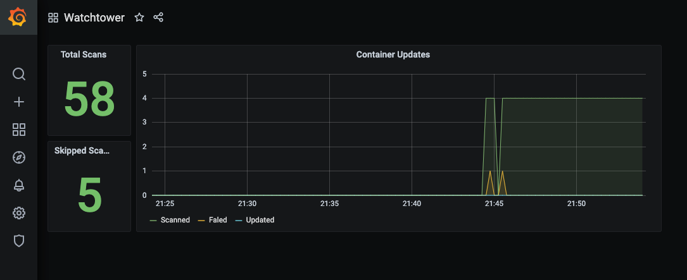

# Metrics API

Metrics can be used to track how Watchtower behaves over time.

To use this feature, you have to set an [API token](../../configuration/arguments/index.md#http_api_token) and [enable the metrics API](../../configuration/arguments/index.md#http_api_metrics),
as well as creating a port mapping for your container for port `8080`.

!!! Note
    You can enable both the metrics API and the update API simultaneously by using both `--http-api-metrics` and `--http-api-update` flags.

!!! Warning
    Enabling the metrics API with port mappings will automatically disable Watchtower's self-update functionality to prevent port conflicts during container recreation. See [Updating Watchtower](../../getting-started/updating-watchtower/index.md#port-configuration-limitation) for more details.

The metrics API endpoint is `/v1/metrics` and provides Prometheus-compatible metrics. This is separate from the [`/v1/update`](../http-api/index.md#http_api_update) endpoint which triggers updates and returns JSON results.

!!! Note
    The `/v1/metrics` endpoint only accepts `GET` requests. Requests with other HTTP methods will receive a `405 Method Not Allowed` response.

## Available Metrics

| Name                                    | Type    | Description                                                                        |
|-----------------------------------------|---------|------------------------------------------------------------------------------------|
| `watchtower_containers_scanned`         | Gauge   | Number of containers scanned for changes during the last scan                      |
| `watchtower_containers_updated`         | Gauge   | Number of containers updated during the last scan                                  |
| `watchtower_containers_failed`          | Gauge   | Number of containers where update failed during the last scan                      |
| `watchtower_containers_restarted_total` | Counter | Number of containers restarted due to linked dependencies since watchtower started |
| `watchtower_containers_skipped`         | Gauge   | Number of containers skipped during the last scan                                  |
| `watchtower_scans_total`                | Counter | Number of scans since watchtower started                                           |
| `watchtower_scans_skipped`              | Counter | Number of skipped scans since watchtower started                                   |

## Example Prometheus `scrape_config`

```yaml
scrape_configs:
  - job_name: watchtower
    scrape_interval: 15s
    metrics_path: /v1/metrics
    bearer_token: demotoken
    static_configs:
      - targets:
        - 'watchtower:8080'
```

Replace `demotoken` with the Bearer token you have set accordingly.

## Demo

The repository contains a demo with prometheus and grafana, available through `/examples/metrics/docker-compose.yml`. This demo
is preconfigured with a dashboard, which will look something like this:


